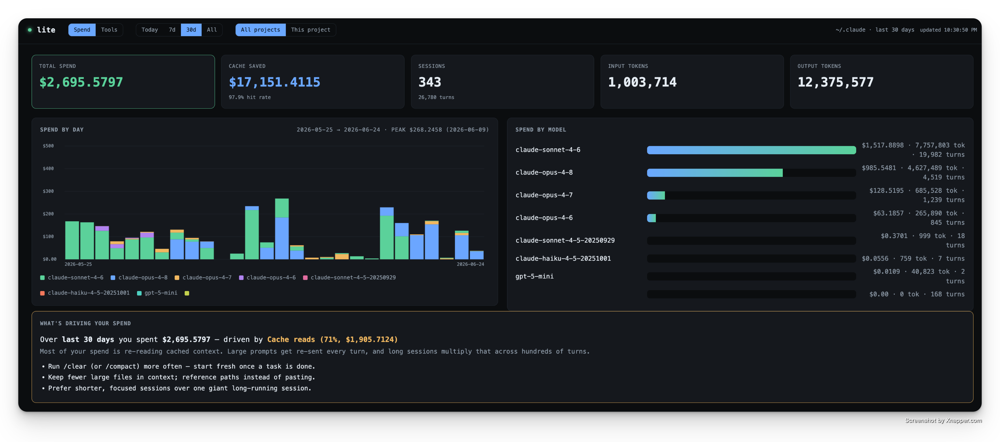
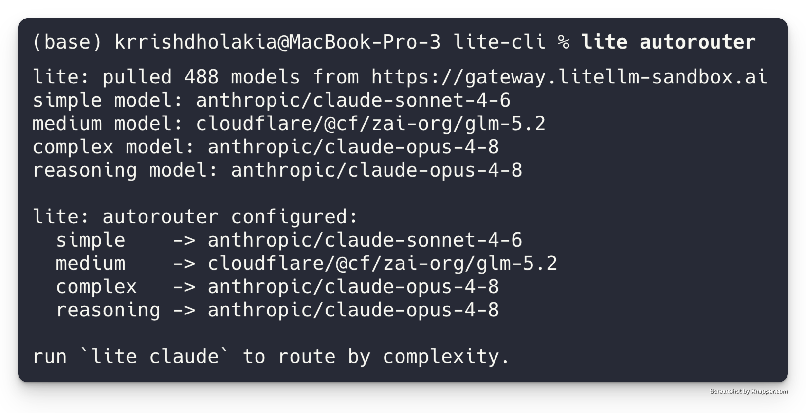
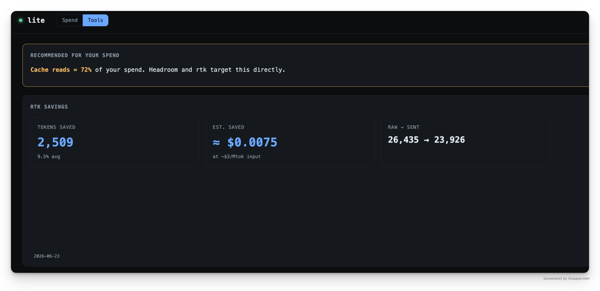
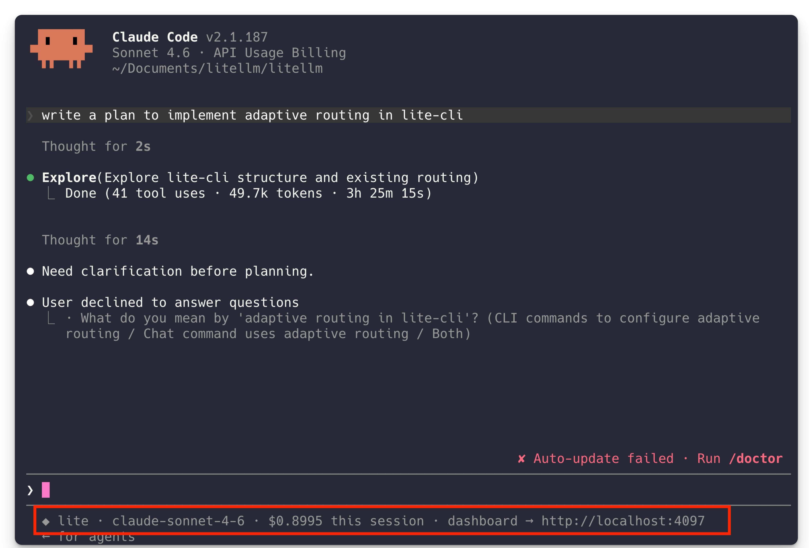

# lite-cli

A thin Rust CLI that wraps [Claude Code](https://github.com/anthropics/claude-code) to help you
**understand and cut its cost** — without changing how you use `claude`.

| | |
|:--:|:--:|
| **Spend observability** — what's driving cost & how to fix it | **Autorouting** — cheapest model that fits each session |
|  |  |
| **Prompt compression** — rtk savings, in the dashboard | **Wraps Claude Code** — live spend in the status line |
|  |  |

## What it does

lite just does three things:

1. **Spend observability** — a live dashboard that shows what every Claude Code session costs,
   broken down by session / project / model / day, and tells you *what's driving spend and how to
   fix it*. Sourced from Claude Code's own transcripts, so it's retroactive and complete.
   → [Spend dashboard](#spend-dashboard)
2. **Autorouting** — point lite at a LiteLLM gateway and it routes each session to the cheapest
   model that fits the work (simple turns → small model, hard turns → frontier model), no manual
   model switching. → [Autorouter mode](#autorouter-mode)
3. **Prompt compression** — one flag (`--litellm_enable_rtk`) injects [rtk](https://github.com/rtk-ai/rtk)'s
   tool-output compression, shrinking the tokens Claude Code sends back into context.

Everything else stays out of the way: lite is a transparent proxy between `claude` and the
upstream API (Anthropic or a LiteLLM gateway). It observes traffic — it doesn't transform it,
except autorouting (opt-in) and rtk (opt-in).

```
claude  ──>  lite proxy (localhost)  ──>  upstream API (Anthropic / LiteLLM gateway)
                  │
                  └── JSONL logs + live spend dashboard
```

## Install

```sh
./install.sh                         # builds release, installs to ~/.local/bin, re-signs on macOS
PREFIX=/usr/local/bin ./install.sh   # custom install location
```

Or manually:

```sh
cargo build --release
cp target/release/lite ~/.local/bin/lite
codesign -s - -f ~/.local/bin/lite   # macOS only — see note below
```

> **macOS note:** `cp` invalidates the binary's ad-hoc code signature on Apple Silicon, after
> which the kernel kills it on launch (`zsh: killed`, exit 137). Re-sign with
> `codesign -s - -f <path>` after copying. `install.sh` does this automatically.

## Usage

```sh
lite claude                      # launch Claude Code through the proxy, log everything
lite claude --litellm_dashboard  # also open the live web dashboard
lite claude --model opus         # any claude flag passes straight through

lite dashboard                   # spend dashboard at http://localhost:4097
lite logs                        # latest session as a table
lite logs --follow               # live tail
```

Every claude flag passes through untouched — `lite claude <whatever you'd pass to claude>`. lite's
own flags all live under the `--litellm_*` namespace so they never collide with claude's, which
means **you almost never need `--`** (use it only to force a literal `--litellm_*` token to claude).

### Flags (`lite claude`)

| Flag | Default | Description |
|------|---------|-------------|
| `--litellm_upstream <url>` | `$ANTHROPIC_BASE_URL` or `api.anthropic.com` | upstream base URL |
| `--litellm_port <n>` | ephemeral | fixed proxy port |
| `--litellm_log_dir <path>` | `~/.lite/logs` | log directory |
| `--litellm_bodies` | off | log full request + response bodies |
| `--litellm_dashboard` | off | also start the web dashboard + open browser |
| `--litellm_enable_rtk` | off | inject [rtk](https://github.com/rtk-ai/rtk)'s tool-output compression hook for this session |

`--litellm_*` is lite's reserved flag namespace; lite parses these (from anywhere on the line) and
strips them before launching `claude`, so they never reach Claude Code.

## Spend dashboard

The dashboard is a **spend-diagnostic tool**: it answers *what's driving my spend, and what do I
do about it* — not just *how much*.

`lite dashboard` reads **Claude Code's own session transcripts** (`~/.claude/projects/**/*.jsonl`)
— so it shows spend across **every** session, retroactively, with no proxy required.

- **Spend driver panel** — ranks `cache_read` / `cache_write` / `output` / `input` by share of
  spend, names the likely cause, and offers concrete fixes, including a generated `CLAUDE.md`
  block you can copy in one click. (Common finding: cache reads dominate spend.)
- **Time range** — Today / 7d / 30d / All, scoping the whole view. "Today" is local midnight.
- **Breakdowns** — by session, by project, by model, plus **Spend by Day** (stacked per model)
  and a cache-savings figure. Toggle **All projects / This project** in the header.
- **Tools tab** — recommends prompt/context compression tools ([Headroom](https://github.com/headroomlabs-ai/headroom),
  [rtk](https://github.com/rtk-ai/rtk)) to drive spend down.

Cost is computed from LiteLLM's
[`model_prices_and_context_window.json`](https://github.com/BerriAI/litellm/blob/litellm_internal_staging/model_prices_and_context_window.json)
(fetched once, cached to `~/.lite/model_prices.json`, refreshed every 24h). The math is a faithful
port of litellm's `generic_cost_per_token` — separate input / output / cache-read / cache-write
rates, long-context (`_above_Nk_tokens`) tiered pricing keyed on **total** context, the 5m/1h
cache-creation split, and service tier. Verified to match litellm's function exactly.

> The proxy's own log (`lite claude` → `~/.lite/logs`) is for **live** low-level observation and
> `lite logs`; the dashboard sources spend from Claude's transcripts. See `AGENTS.md`.

## Autorouter mode

> Opt-in and off by default. This is the **one** place lite stops being transparent — it rewrites
> the request `model` and injects gateway auth. With no config, the proxy path is byte-for-byte
> unchanged. See `AGENTS.md` for the design rationale.

Point lite at a LiteLLM gateway and let it route each session to the cheapest model that fits the
work — simple turns to a small model, hard turns to a frontier model — without you switching
models by hand.

**1. Log into the gateway** — stores base URL + api key in `~/.lite/settings.json` (0600):

```sh
lite login
# enter api base
# enter api key
```

**2. Assign a model per complexity tier** — lists the gateway's models and lets you pick one for
each tier:

```sh
lite autorouter
# pick: simple / medium / complex / reasoning
```

This writes the six fields lite needs to route:

```jsonc
// ~/.lite/settings.json
{
  "api_base":        "https://your-gateway...",
  "api_key":         "sk-...",
  "simple_model":    "claude-sonnet-4-6",
  "medium_model":    "glm-5.2",
  "complex_model":   "claude-opus-4-8",
  "reasoning_model": "claude-opus-4-8"
}
```

**3. Run as usual** — with all six fields present, `lite claude` routes automatically:

```sh
lite claude
```

How it routes:

- The first turn of a session is classified by `classifier.rs` — a local, rule-based port of
  litellm's `complexity_router` plus Claude Code signals (the `thinking` field → reasoning, tool
  count, conversation size). **No API calls.**
- That tier is **locked for the whole session** so Anthropic prompt caching stays stable. The
  small/fast slot always uses `simple_model`.
- The proxy rewrites `model` to the tier's model and injects the gateway api key for that request.

The injected status line shows the dashboard URL and the session's routed model + spend from
inside the Claude Code TUI.

## Where logs live

`~/.lite/logs/session-<timestamp>.jsonl` — one JSON object per API call (model, input/output
tokens, cache reads, latency, status). `~/.lite/logs/latest` points at the active session.

## How it redirects Claude Code

Claude Code reads `ANTHROPIC_BASE_URL` from `~/.claude/settings.json` (`env` block), which
overrides the process environment. So `lite` injects the proxy URL via
`claude --settings '{"env":{"ANTHROPIC_BASE_URL":"http://127.0.0.1:<port>"}}'`, which has higher
precedence. In transparent mode your auth token is left untouched and forwarded verbatim by the
proxy; only [autorouter mode](#autorouter-mode) swaps it for the gateway key.

## License

MIT
